# 🚀 Secure Digital Banking System with Fraud Detection & Real-Time Processing

A production-inspired backend system that simulates real-world digital banking with secure transactions, ledger-based accounting, fraud detection, concurrency control, audit logging, and real-time updates.

---

## 📌 Problem Statement

Traditional digital payment systems face several challenges:

- Duplicate transactions caused by retries
- Lack of fraud detection mechanisms
- Double spending due to concurrent requests
- Limited auditability and transparency
- No real-time transaction updates
- Weak security and access control

Most student projects focus only on CRUD operations and ignore these real-world problems.

This project addresses these challenges by implementing a secure and scalable digital banking backend.

---

# ✨ Features

## 🔐 Authentication & Security

- JWT Authentication
- Password hashing using bcrypt
- Token blacklisting (Logout support)
- Rate limiting to prevent API abuse
- Input validation using Zod
- Secure headers with Helmet
- CORS protection

## 👤 Account Management

- Create account
- Check account status
- Freeze account (Admin)
- Unfreeze account (Admin)

## 💸 Transaction System

Supports:

- Send money
- Receive money

Transaction states:

- Pending
- Completed
- Failed

## 📒 Ledger-Based Architecture (Core Feature)

Instead of storing balance directly:

- Every transaction creates ledger entries.
- Balance is derived from the ledger.
- Ensures consistency and transparency.

## 🔁 Idempotent Transactions

Prevents duplicate transactions using unique **Idempotency Keys**.

Benefits:

- Retry-safe payments
- No duplicate money transfers
- Reliable transaction processing

## 🛡 Fraud Detection System

Detects suspicious activities such as:

- Large amount transactions
- High-frequency transactions
- Unusual patterns

Risk Levels:

- Low
- Medium
- High

Suspicious transactions are recorded in Fraud Logs.

## ⚡ Concurrency Control

Prevents:

- Double spending
- Race conditions

Implemented using:

- MongoDB Transactions
- Locking mechanisms

## 🔴 Real-Time Updates

Using Socket.io:

- Live transaction notifications
- Real-time balance updates
- Instant transaction status changes

## 📧 Email Services

Implemented using Nodemailer.

Supports:

- Transaction success notifications
- Transaction failure alerts
- Fraud detection alerts
- OTP verification emails
- Forgot password email with reset link
- Password reset confirmation email

---


## 👥 Role-Based Access Control (RBAC)

### User

- Perform transactions
- View transaction history
- View ledger

### Admin

- Freeze accounts
- Unfreeze accounts
- Monitor fraud alerts
- View audit logs

## 📊 Analytics & Insights

Provides:

- Monthly spending summary
- Transaction statistics
- Expense analysis

## 📝 Audit Logging

Tracks:

- User actions
- Transaction events
- Administrative activities

Ensures transparency and traceability.

## 📧 Notification System

Email alerts for:

- Successful transactions
- Failed transactions
- Fraud alerts

Implemented using Nodemailer.

## 🔒 Advanced Security (Optional)

- OTP Verification
- Transaction PIN
- Multi-factor Authentication

---

# 🧠 AI Feature (Planned)

#### Dynamic Content Translation

Using Google Gemini API:

- Transaction messages
- Notifications
- Dynamic responses


### Optional Optimization

Redis caching to reduce API calls and improve performance.

> **Status:** Planned for future implementation.

---

# 🏗 System Architecture
User Request
↓
Input Validation
↓
Authentication
↓
Fraud Detection
↓
Transaction Creation (Pending)
↓
Ledger Update
↓
Balance Calculation
↓
Notification Service
↓
Real-Time Socket Event
↓
Response to User


---

# 🛠 Tech Stack

## Backend

- Node.js
- Express.js

## Database

- MongoDB Atlas
- Mongoose

## Authentication

- JWT
- bcrypt

## Validation

- Zod

## Security

- Helmet
- CORS
- express-rate-limit

## Real-Time Communication

- Socket.io

## Email Service

- Nodemailer

## Testing

- Postman

## Version Control

- Git & GitHub

---

# 🗂 Database Schema

## User

```javascript
{
  name,
  email,
  password,
  role,
  createdAt
}

Account
{
  userId,
  accountNumber,
  status,
  createdAt
}

Transaction
{
  fromAccount,
  toAccount,
  amount,
  status,
  idempotencyKey,
  createdAt
}

Ledger
{
  accountId,
  type,
  amount,
  transactionId,
  balanceAfter,
  createdAt
}

FraudLog
{
  transactionId,
  riskLevel,
  reason,
  createdAt
}

BlacklistedToken
{
  token,
  expiresAt
}

AuditLog
{
  userId,
  action,
  details,
  createdAt
}

🌐 API Endpoints
Authentication APIs
POST /api/auth/register
POST /api/auth/login
POST /api/auth/logout

Account APIs
GET  /api/account/status
POST /api/account/freeze
POST /api/account/unfreeze

Transaction APIs
POST /api/transaction/send
GET  /api/transaction/history

Ledger APIs
GET /api/ledger/:accountId

Fraud APIs
GET /api/fraud/alerts

Analytics APIs
GET /api/analytics/summary

⚠ Edge Cases Handled
✅ Duplicate transactions blocked using idempotency keys
✅ Insufficient balance handling
✅ Frozen accounts cannot transact
✅ Invalid inputs rejected using Zod validation
✅ API abuse prevented using rate limiting
✅ Concurrent requests handled safely
✅ Failed transactions tracked properly

🔐 Security Measures
JWT Expiry
Password Hashing
Input Validation
Rate Limiting
Secure Headers
Token Blacklisting
CORS Protection

🚀 Scalability

Future scalability improvements:

Redis Caching
BullMQ Queue System
Event-Driven Architecture
Microservices Architecture


# 📸 Screenshots

1. **Login Page**
   - Secure user authentication with JWT
   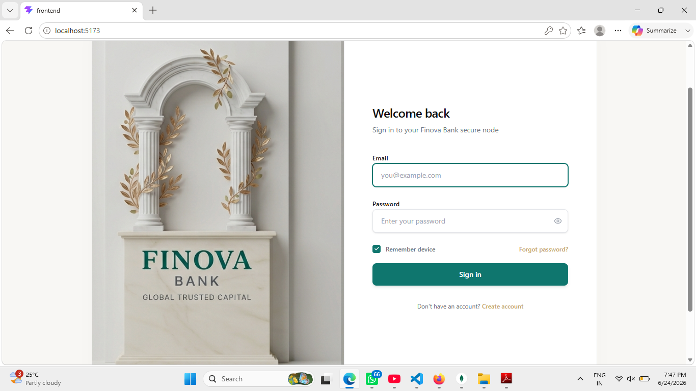

2. **Register Page**
   - Create a new account with validation and password hashing
   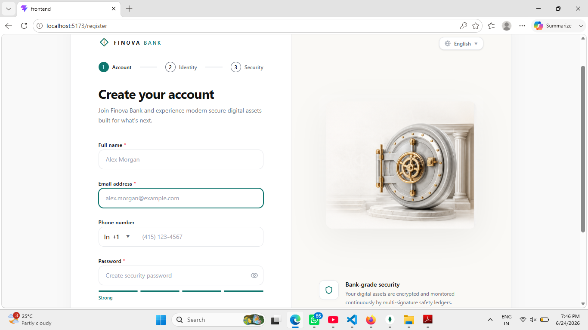

3. **Dashboard**
   - View account overview and recent transactions
   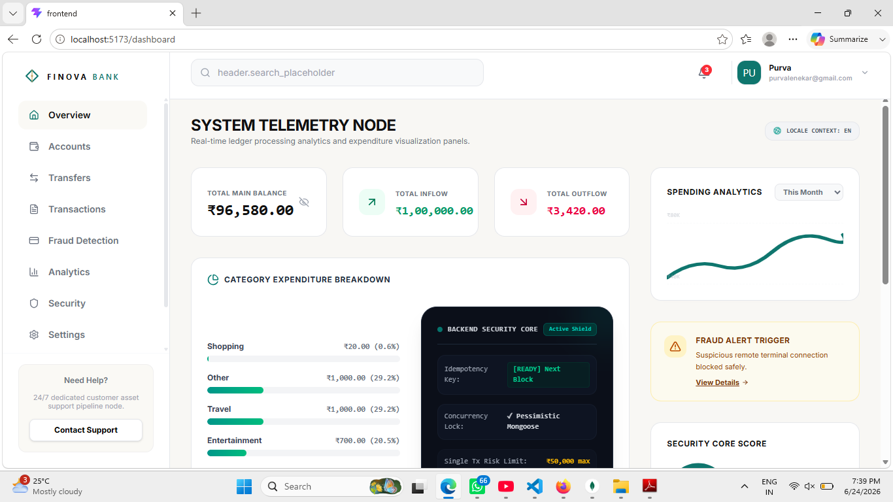

4. **Accounts**
   - Manage bank accounts and view balances
   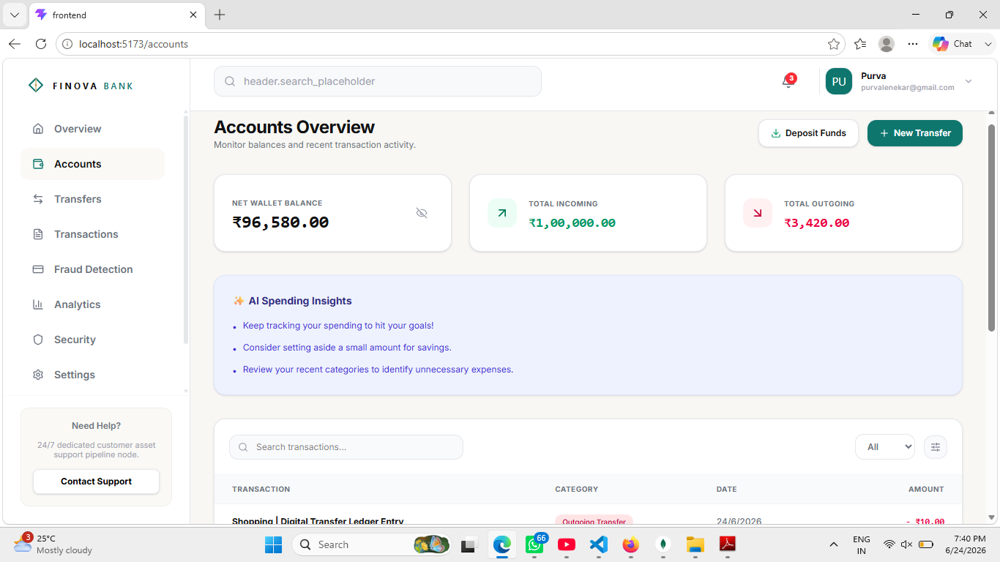

5. **Money Transfer**
   - Transfer funds securely between accounts
   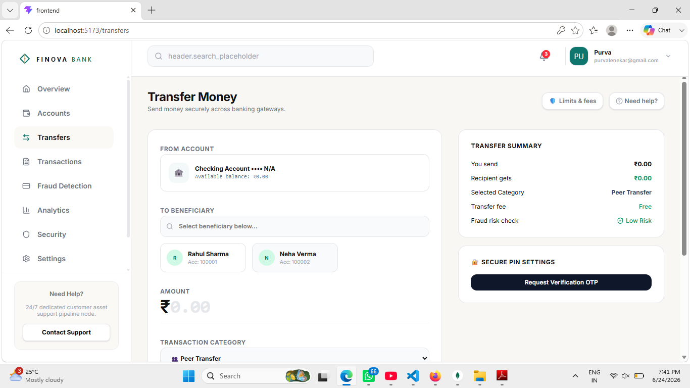

   - Transaction confirmation and status
   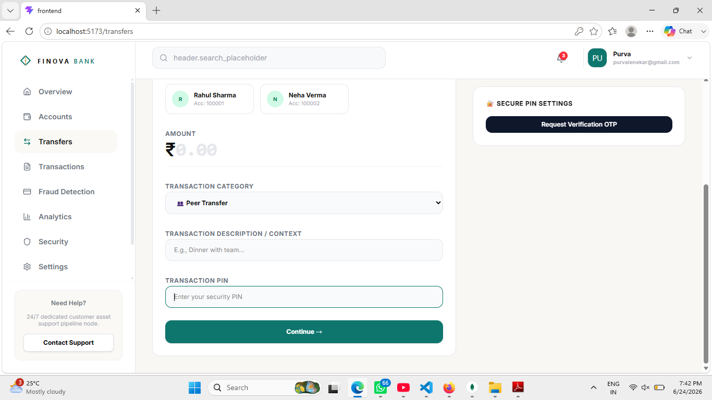

6. **Transaction History**
   - View completed, pending, and failed transactions
   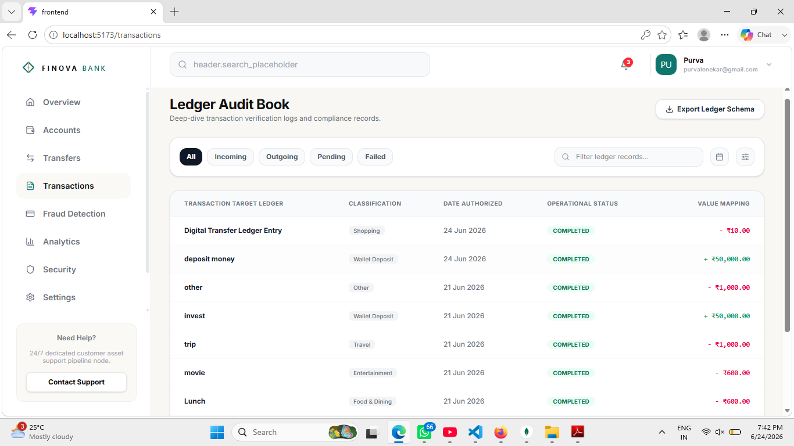

7. **Fraud Detection**
   - Monitor suspicious activities and alerts
   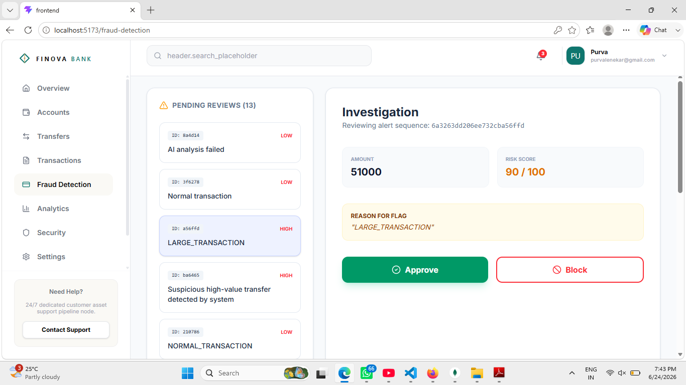

8. **Analytics Dashboard**
   - Monthly spending trends and summaries
   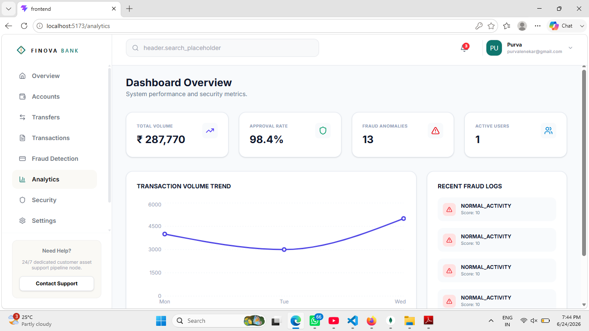

9. **Security Settings**
   - Manage OTP, password reset, and account security
   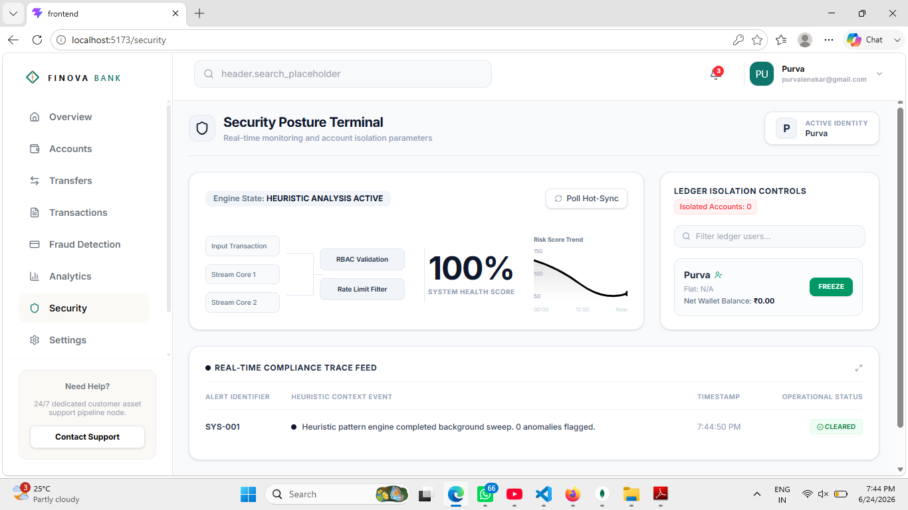

10. **Settings**
    - Customize profile and application settings
    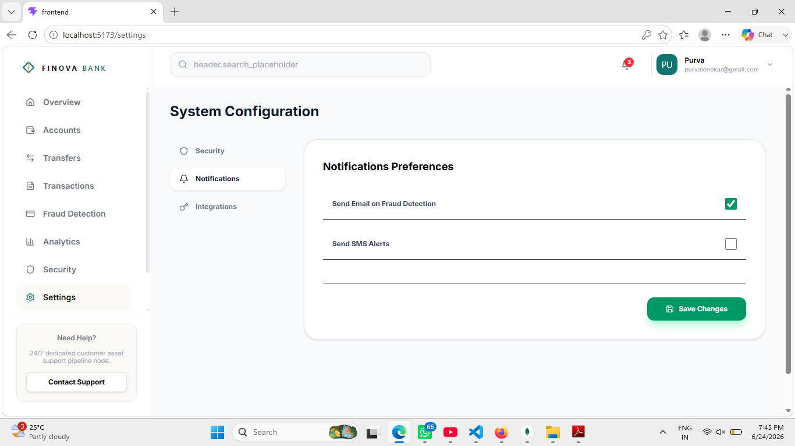

---